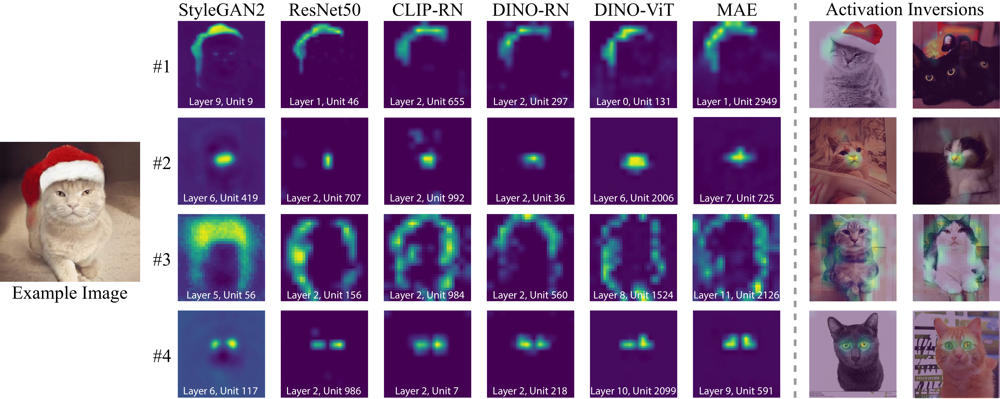
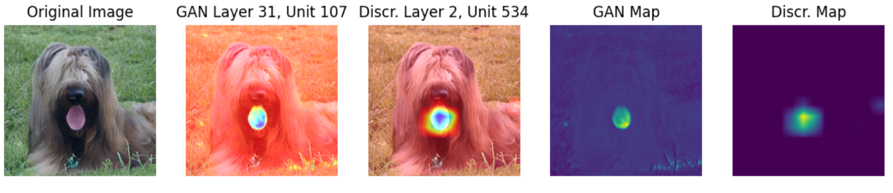
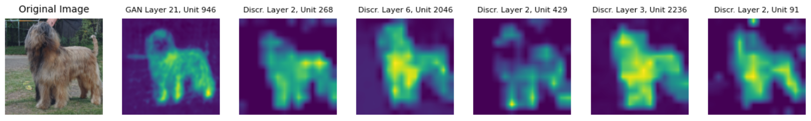
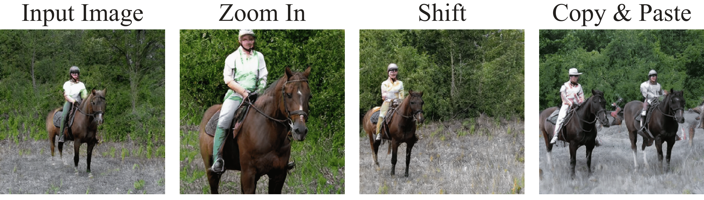
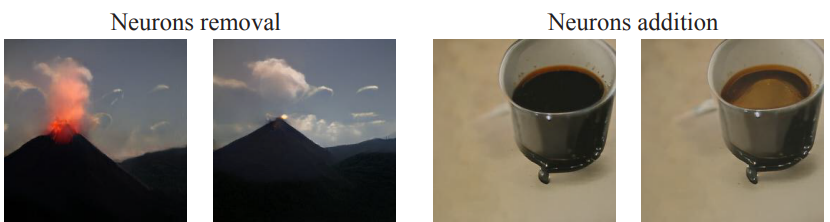
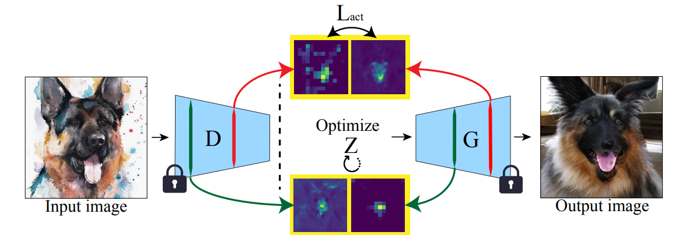

# Rosetta Neurons
[[paper](https://arxiv.org/abs/2306.09346)] [[project page](https://yossigandelsman.github.io/rosetta_neurons)]

Official implementation of the paper "Rosetta Neurons: Mining the Common Units in a Model Zoo."



>We demonstrate the existence of common features we call ``Rosetta Neurons" across a range of models with different architectures, different tasks (generative and discriminative), and different types of supervision (class-supervised, text-supervised, self-supervised). We present an algorithm for mining a dictionary of Rosetta Neurons across several popular vision models: Class Supervised-ResNet50, DINO-ResNet50, DINO-ViT, MAE, CLIP-ResNet50, BigGAN, StyleGAN-2, StyleGAN-XL. Our findings suggest that certain visual concepts and structures are inherently embedded in the natural world and can be learned by different models regardless of the specific task or architecture, and without the use of semantic labels. We can visualize shared concepts directly due to generative models included in our analysis. The Rosetta Neurons facilitate model-to-model translation enabling various inversion-based manipulations, including cross-class alignments, shifting, zooming, and more, without the need for specialized training.

## Setup
Our code is developed in `PyTorch 1.13` with`python=3.8.5` and `CUDA 11.7`.

To replicate our environment, install [Anaconda](https://docs.anaconda.com/free/anaconda/install/index.html), and run the following commands.
```
$ conda env create -f rosetta.yml
$ conda activate rosetta
```
If you run any of the code and receive the following error: `CUDA error: no kernel image is available for execution on the device`, you can fix this simply by installing the PyTorch version compatible with your CUDA device (see [here](https://pytorch.org/get-started/previous-versions/)).

The StyleGAN2, StyleGAN3, and MAE models require checkpoints, which can be downloaded from [here](https://drive.google.com/drive/folders/1NGKgKxcyor7enTMcFcO9B55RSmAU_eHx?usp=sharing). Place the checkpoint files in the parent directory. 

## Matching GAN and Discriminative Model [](https://colab.research.google.com/drive/1XWZpIaluldJEMyjzxRFl7OuWRCc4Q5SA?usp=drive_link)
We provide an interactive notebook for running matching between a GAN and discriminative model in `notebooks/Main.ipynb`. Additionally, we provide an example `run_match.sh` script for running the neuron matching in `match.py`.  Simply run
```
$ bash run_match.sh
```
This will output the activation statistics for the GAN and discriminative model in the specified save path as well as the table of similarity scores between each pair of units between the two models.

You can use the `--gan_mode` flag to choose the GAN model from the following options:
* `biggan`, `styleganxl`, `stylegan3-ffhq`, `stylegan3-afhq`, `stylegan2-lsun_cat`, `stylegan2-lsun_horse`, `stylegan2-lsun_car` 

You can use the `--discr_mode` flag to choose the discriminative model from the following options:
* `mae`, `dino`, `dino_vitb8`, `dino_vitb16`, `clip`, `resnet50`

You can seamlessly integrate other models into our code by adding the loading code to `models.py` and specifying the latent vector dimensions in `dataset.py`.


## Visualizing Pairwise Matches [](https://colab.research.google.com/drive/1ihk4ewUtMj5GARP5hzFUZZB-7MXcomUY?usp=sharing)
We provide a notebook for visualizing the matches between a GAN and one discriminative model in `notebooks/Visualize_Pairwise.ipynb`. You can run this after running the matching between a pair of models. In the Colab demo, you can also choose to visualize the matches we have already generated. The result will be a visualization of the set of "best buddy" pairs between the GAN model and the discriminative model. An example of one such pair is shown below. 


## Visualizing Rosetta Neurons [](https://colab.research.google.com/drive/1-b0njXs65guzb3OS2GaS0VTzDdI6Wlvn?usp=sharing)
We provide a notebook for visualizing the "Rosetta Neurons," which are the set of neurons encoding shared concepts across all the models (ie: GAN model, Class Supervised-ResNet50,
DINO-ResNet50, DINO-ViT, MAE, CLIP-ResNet50). This can be found in `notebooks/Visualize_Rosetta_Neurons.ipynb`. You can run this after running the matching between a GAN and 1) Class Supervised-ResNet50, 2) DINO-ResNet50, 3) DINO-ViT, 4) MAE, 5) CLIP-ResNet50. In the Colab demo, you can also choose to visualize the matches we have already generated. The result will be a visualization of the mined Rosetta Neurons between the GAN model and the discriminative models. An example of one such set is shown below. 


## Rosetta Neurons-Guided Editing (Shift, Zoom, Copy & Paste) [](https://drive.google.com/file/d/1gNfBQb9zHH-tpBBeyajetgijsyD5civC/view?usp=sharing)
We provide a notebook for conducting Rosetta Neurons-guided editing (shifting, zooming, copying and pasting) in `notebooks/shift_zoom_copypaste.ipynb`. An example of such edits is shown below. 


## Rosetta Neurons-Guided Fine-Grained Editing [](https://drive.google.com/file/d/1KxqPERXOk4pWM6TC6b299agQTwlu23Em/view?usp=sharing)
We provide a notebook for conducting Rosetta Neurons-guided fine-grained editing in `notebooks/single_neuron_edit.ipynb`. Examples of such edits are shown below. 



## Rosetta Neurons-Guided Inversion [](https://drive.google.com/file/d/18ACFeah5Ey0XaYS2ywOiqWlG2gfgOVWW/view?usp=sharing)
We provide a notebook (`notebooks/rosetta-inversion-stylegan-xl.ipynb`) for conducting Rosetta Neurons-guided inversion with StyleGAN-XL, which can also facilitate cross-class alignment or image-to-image translation into the GAN's domain. The method is shown below. 



## Citation
If you found this repository useful please consider starring ⭐ and citing:
```
@InProceedings{Dravid_2023_ICCV,
    author    = {Dravid, Amil and Gandelsman, Yossi and Efros, Alexei A. and Shocher, Assaf},
    title     = {Rosetta Neurons: Mining the Common Units in a Model Zoo},
    booktitle = {Proceedings of the IEEE/CVF International Conference on Computer Vision (ICCV)},
    month     = {October},
    year      = {2023},
    pages     = {1934-1943}
}
```
